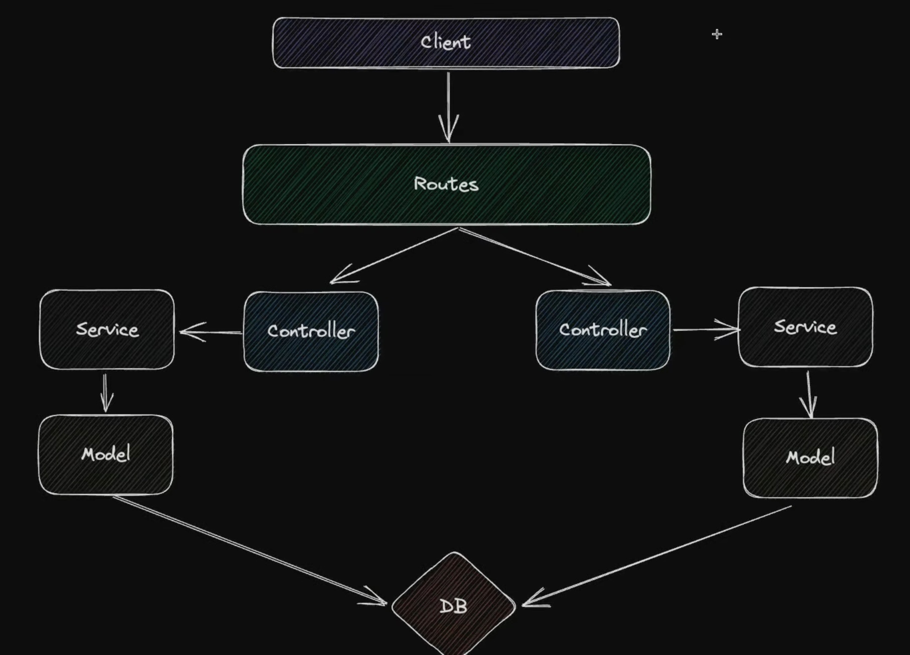

# 폴더 구조

퍼피랑 백앤드 작업은 유지 보수 및 가독성을 위해 3계층 구조 설계를 기반으로 했습니다.

### 3계층 구조 설계

3계층 구조 설계는 프로그래밍 원칙은 관심사 분리 원칙을 기반으로 한 것이며, 백엔드 코드를 3개의 구조로 나눠 구현하는 것을 말한다. 크게 Controller, Service, Data Access Layer(Model)로 나눠져 있습니다.

- 관심사 분리(Seperation Of Concerns): 각각의 모듈들이 여러 일을 하는 것이 아니라 하나의 일(목적)만 담당하도록 하는 것

- `routes`: 라우팅 담당
- `controller`: 라우팅 이후를 담당 서비스와 라우팅을 연결하는 부분
- `serverice`: 비즈니스 로직 및 3rd party를 사용할 경우 사용
- `model`: 데이터 베이스에 대해 접근이 필요한 경우 사용
- `utill`: 공통으로 사용하는 로직

참고:[https://node-js.tistory.com/22](https://node-js.tistory.com/22)

[https://www.youtube.com/watch?v=fc6o1gwqZuA&t=253s](https://www.youtube.com/watch?v=fc6o1gwqZuA&t=253s)

[https://www.youtube.com/watch?v=H9M02of22z4](https://www.youtube.com/watch?v=H9M02of22z4)

[https://charming-kyu.tistory.com/16](https://charming-kyu.tistory.com/16)
