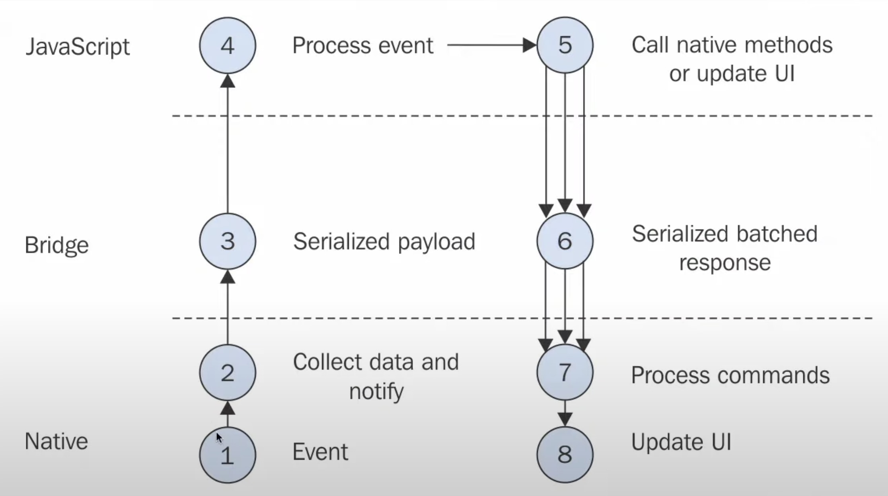

# React Native

React Native는 React와 앱 플랫폼의 기본 기능을 사용하여 Android 및 iOS 애플리케이션을 구축하기 위한 오픈 소스 프레임워크입니다.

### 구조

React를 확인해보면 코드를 작성하면 해당 코드를 JS로 컴파일하고, 브라우저가 실행해주는 단계로 진행됩니다. 하지만 React Native는 브라우저가 없는 등 해당 방식과는 확연한 차이가 있습니다. React Native에서 쉽게 말해 번역기로, 우리의 코드와 운영체제(iOS, Android) 사이에 있습니다. 즉, RN코드를 작성하면, 해당 코드가 iOS 또는 Java 안드로이드 코드로 번역이 되는 방식 입니다.

예를 들어, RN코드로 버튼을 만든다면, 

1. RN 버튼 코드 작성 
2. iOS, 안드로이드에게 버튼을 그려달라고 요청 
3. 운영체제에서는 버튼을 표시 → 이런 이유로 iOS와 안드로이드에 버튼이 다른 모양으로 노출

브라우저가 없기 때문에 직접 실행하는 것이 아니라 Bridge를 통해서 운영체제와 이야기를 하는 구조입니다.

### 동작 방식

이벤트의 동작 방식은 아래와 같습니다.

1. Native에서 이벤트 감지
2. Native에서 데이터와 알림을 수집
3. React Native는 그 정보를 가지고 JSON 메시지를 생성(Bride)
4. JS는 해당 정보를 수집 후 처리
5. 해당 응답을 React Native를 통해 Native에 메시지를 보냄.
6. UI 업데이트  

여기서 중요한 점은 Javascript는 웹처럼 브라우저에서 실행되는 구조가 아니라, 메시지를 주고 받기 위해 사용하는 레이어일 뿐입니다.

마지막으로, 실제 앱을 배포하기 위해서는 해당 코드를 안드로이드에서는 Android Java, iOS에는 Swift로 컴파일을 해야 합니다.

### 웹뷰

웹뷰(WebView)는 **네이티브 앱에 내재되어 있는 웹 브라우저입니다.** 웹뷰를 사용하면 웹 콘텐츠를 네이티브 앱 뷰와 같이 사용자에게 보여줄 수 있습니다. 일반 웹 브라우저와 달리 웹뷰에는 주소창, 새로고침, 즐겨찾기와 같은 기능은 없고 단순히 웹페이지만 보여줍니다.

장점은 아래 항목이 있습니다.

- 여러 플랫폼에서 사용가능 ⇒ 하나의 코드로 iOS, Android 플랫폼을 이용할 수 있습니다.
- 빠른 업데이트 ⇒ 앱을 배포하려면 스토어의 심사가 필요하나 웹뷰는 해당 심사 필요 없이 바로 변경할 수 있습니다.

단점

- 성능이 비교적 낮은 편 ⇒ 네이티브 앱은 이미 스토어에 빌드가 완료되지만, 웹뷰는 해당 사이트에서 리소스를 다운로드 해야 되기 때문에, 시간이 필요합니다.
- UI가 제한적 ⇒ 웹뷰는 css, html, JS를 사용하기 때문에, 네이티브 앱의 UI를 구성하는 것보다 제한적입니다.
- 사용자 경험 ⇒ 모바일 네이티브 기능을 사용할 수 없어서 사용자 경험이 떨어질 수 있음.
- 앱의 심사가 비교적 힘듬 ⇒ 웹 사이트를 무단으로 사용하거나, 웹사이트만 보여주는 단순한 앱이 스토어에 등록되는 것을 방지하고 있기 때문에, 비교적 앱의 심사가 복잡한 편입니다.

참고: https://docs.tosspayments.com/resources/glossary/webview

https://www.wanted.co.kr/community/post/633

https://wp.swing2app.co.kr/knowledgebase/appstore-reject/

### Expo

Expo는 React Native앱을 직접 Native코드로 컴파일 하지 않고 `Javascript`, `Markup/Styling` 이 두 가지만 작성하면 결과를 실제 앱처럼 테스트할 수 있습니다.

자세한 내용은 [expo.dev](https://expo.dev/) 참고 부탁드립니다.

