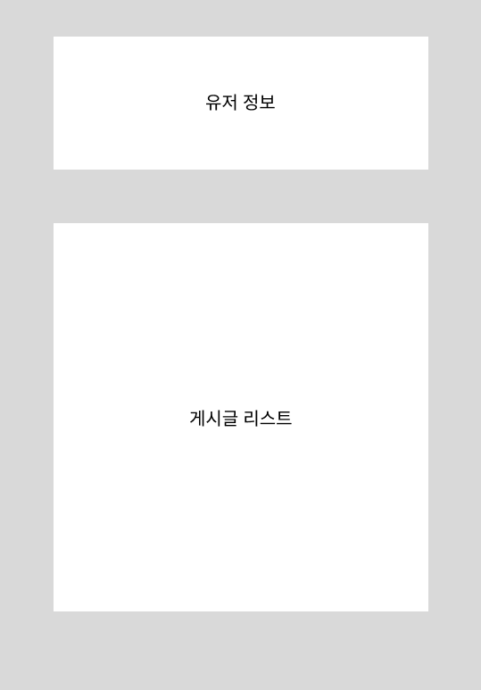
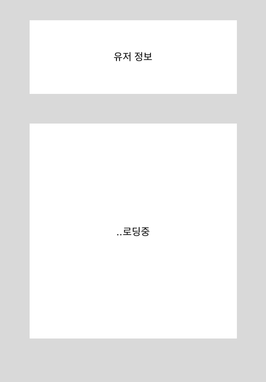

# Suspense With SSR

React 18에는 React SSR(Server Side Rendering)성능에 대한 아키텍처 개선 사항이 포함되어 있습니다. SSR의 동작순서를 먼저 살펴보면, 

1. 서버에서 데이터를 fetch 합니다.
2. 서버에서 HTML을 렌더하고, response안에 실어서 보냅니다.
3. 그리고나서, 클라이언트에서 자바스크립트 코드를 로드합니다.
4. 마지막으로, 클라이언트에서 서버에서 만들어진 HTML에 JS를 연결합니다 (hydration) 

여기서 SSR의 문제점은 각 단계가 전체 앱에 대해 한 번에 완료되어야 다음 단계를 시작할 수 있습니다. 예를 들어 유저와 게시글 데이터를 서버에서 가져와야 된다고 했을 때, 만약 유저 정보가 1초 게시글 정보가 10초가 걸린다면 유저 정보는 1초만에 데이터를 가져올 수 있지만 게시글 데이터를 가져올 때 가지 기다려야 됩니다. 



React는 `Suspense`를 통해 SSR을 더 작은 독립 단위로 세분화할 수 있으며, 이러한 단계는 서로 독립적으로 진행되며 **앱의 나머지 부분을 차단하지 않습니다.** 이를 위해 2018년에 `Suspense`를 도입했고, 클라이언트의 지연 로딩 코드에만 지원했습니다. 하지만 서버 렌더링과 통합하여 이러한 문제를 해결하는 것이 목표였습니다.

### Suspense를 이용한 SSR 문제점 해결

1. Streaming HTML on the server

오늘날의 SSR은 all or nothing입니다. 위에 예제 코드에서 게시글 정보에 대한 데이터를 서버에서 가져올 때까지 모든 순서는 blocking됩니다.

하지만 React 18의 Suspense를 사용할 경우 해당 문제를 해결할 수 있습니다. 예를 들어 `Suspense`로 `<Posts>`를 감쌀 경우 `Posts`데이터를 가져오는 것을 기다릴 필요가 없다고 React에게 알려줍니다. 대신 React는 기다리는 동안 `<Spinner/>` 를 노출하게 됩니다.

```jsx
<Layout>
  <NavBar />
  <Sidebar />
  <Main>
    <User />
    <Suspense fallback={<Spinner />}>
      <Posts />
    </Suspense>
  </Main>
</Layout>
```



이후에, 서버에서 게시글에 대한 데이터가 준비되면 React는 같은 Stream에 추가적인 HTML을 보내고, 최소한의 인라인 `<script>`태그를 사용하여 해당 HTML를 **올바른 위치에 배치**합니다.

1. Selective Hydration on the client

또 하나의 SSR의 개선점은 이제, 게시글의 hydration의 더 이상 브라우저가 **다른 작업을 수행하는 것을 방해하지 않습니다**. React 18에서는 브라우저가 이벤트를 처리할 수 있는 작은 간격으로 Suspense 내부에 컨텐츠를 하이드레이팅합니다. 덕분에 클릭이 즉시 처리되고, 저사양 기기에서 오랫동안 hydration이 발생하는 동안에도 브라우저는 멈추지 않습니다. 예를 들어, 게시글 정보를 가져오는 동안에도 유저 정보를 클릭한다면 해당 작업을 막히지 않고 유저 관련 페이지로 넘어갈 수 있습니다. 

해당 예제에서는 오직 게시글만 `Suspense`로 감쌌지만, 더 많은 곳에서 `Suspense`를 사용하면 더 효율적인 작업을 할 수 있습니다. 

```jsx
<Layout>
  <NavBar />
  <Suspense fallback={<Spinner />}>
    <Sidebar />
  </Suspense>
  <RightPane>
    <Suspense fallback={<Spinner />}>
      <Posts />
    </Suspense>
  </RightPane>
</Layout>
```

해당 코드에서 해당 페이지의 HTML은 로드되었지만, 아직 JS코드가 로드되지 않았다고 가정해보겠습니다. 그러면 Sidebar와 Posts에 대한 코드가 포함된 번들이 로드됩니다. React는 트리의 앞부분에서 찾은 `Suspense Boundary`부터 시작하여 두 가지 모두 `hydrate`를 시도합니다. 그러나 사용자가 로드된 `Posts`에 대한 interaction을 시도했다고 가정한다면, `React`는 인터랙션 이벤트의 캡처 단계에서 동기적으로 업데이트합니다. 결과적으로 `Posts`는 인터랙션을 처리하고 응답할 수 있도 록 제때에 `hydrate`합니다. 그러면 이후  `React`는 먼저 처리해야 되는 일이 없으므로 `Sidebar`를 채우게 됩니다.

**Selective Hydration 덕분에, React는 가능한 빨리 모든 것에 hydrate를 시작하고, 사용자 상호작용에 따라 화면에서 가장 급한 부분의 우선 순위**를 정하게 됩니다. React는 모든 부모 **Suspense Boundary의 컨텐츠에 우선적으로 hydrate**를 하지만, 관련 없는 형제는 건너뜁니다. 이렇게 하면 상**호 작용 경로에 있는 컴포넌트가 먼저 hydrate되기 때문에, 즉각적으로 hydrate되는 것처럼 보이게 됩니다.**

```jsx
<Layout>
  <NavBar />
  <Suspense fallback={<BigSpinner />}>
    <Suspense fallback={<SidebarGlimmer />}>
      <Sidebar />
    </Suspense>
    <RightPane>
      <Post />
      <Suspense fallback={<CommentsGlimmer />}>
        <Comments />
      </Suspense>
    </RightPane>
  </Suspense>
</Layout>
```

위의 예제에서, 초기에 HTML에는 `NavBar`가 포함될 수 있지만 나머지는 관련 코드가 로드되는 즉시 스트리밍되어 사용자가 인터랙션한 부분에 우선순위를 두고 부분적으로 hydrate됩니다. 

참고: https://github.com/reactwg/react-18/discussions/37
